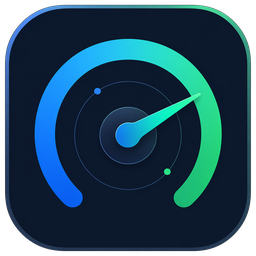
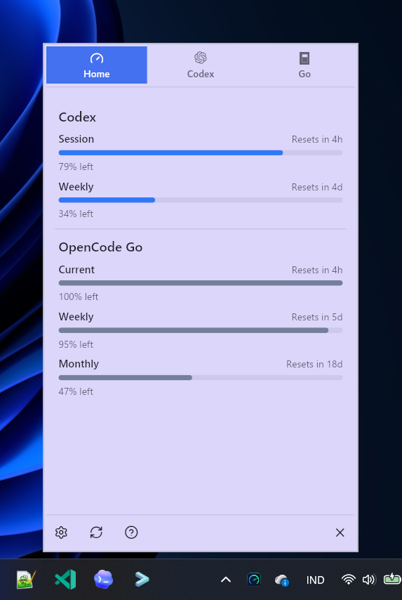

<p align="center">
  
</p>

<h1 align="center">Usage Radar</h1>

<p align="center">
  A small tray app for checking AI usage limits without opening dashboards, browser tabs, or account pages.
</p>

<p align="center">
  <a href="https://github.com/athif23/usage-radar/actions/workflows/ci.yml">
    
  </a>
  <a href="https://github.com/athif23/usage-radar/actions/workflows/release.yml">
    
  </a>
  <a href="https://github.com/athif23/usage-radar/releases/latest">
    
  </a>
</p>

<p align="center">
  
</p>

Usage Radar is a tray-first desktop app for people who use tools like Codex and GitHub Copilot and want to know, quickly, what is safe to use right now.

Today it is tested properly on Windows, with macOS and Linux as follow-up targets.

Instead of bouncing between dashboards, auth files, and account pages, you open the tray popup and check your remaining budget in a couple of seconds.

Right now the app supports:

- Codex
- GitHub Copilot
- OpenCode Go

## Why I built it

I kept wanting a tiny utility for this.

AI usage limits live in too many places:

- browser dashboards
- account pages
- CLI auth state
- provider-specific internal endpoints
- and sometimes nowhere obvious at all

There are already apps in this space, but many of them are macOS-only or built around a webview stack like Tauri or Electron. I wanted something that felt more like a small Windows utility: fast to open, light on overhead, and built directly in Rust with [`iced`](https://github.com/iced-rs/iced).

The goal is simple: open the tray popup, glance at the numbers, and move on.

Usage Radar is an unofficial utility and is not affiliated with OpenAI or GitHub.

## What it does today

- lives in the system tray
- opens a compact popup instead of a full dashboard window
- shows real Codex usage data
- shows real GitHub Copilot usage data
- shows real OpenCode Go usage data
- caches the last known snapshot locally
- labels stale, unavailable, and partial states honestly
- includes a small settings view for refresh timing, appearance, startup behavior, provider visibility, and optional urgency sorting
- supports light and dark mode
- can launch at startup on Windows
- brings the popup back to the front if it is already open behind another app

## Provider support

| Provider | Status | Source | Confidence |
| --- | --- | --- | --- |
| Codex | Working | `~/.codex/auth.json` or `CODEX_HOME/auth.json` + `https://chatgpt.com/backend-api/wham/usage` | Exact |
| GitHub Copilot | Working | GitHub device flow + `https://api.github.com/copilot_internal/user` | Partial |
| OpenCode Go | Working | Windows browser session import from Chrome/Brave/Edge or manual cookie fallback + usage page parsing based on the CodexBar approach | Exact |
| Claude Code | Planned | Not wired yet | — |

### What "partial" means

GitHub Copilot can return useful quota percentages while still leaving out some details, especially reset timing. Usage Radar shows that as partial instead of pretending the data is more complete than it is.

## Why this repo may be useful if you're learning `iced`

This is a real app, not a gallery of isolated widgets.

If you are learning `iced`, this repo shows how to build a tray-first utility with a compact popup UI without reaching for a browser shell.

A few things in here that may be useful:

- `iced::daemon` for a tray-style app with no normal main window
- `tray-icon` integration
- keeping one popup window alive and hiding/showing it instead of recreating it every click
- focus-aware tray click behavior
- bottom-right popup positioning on Windows
- background refresh using `Task` and subscriptions
- local JSON config and cache persistence with `serde`
- provider adapters that normalize provider-specific responses into one shared snapshot shape

## How it is organized

```text
usage-radar/
├── assets/
├── docs/
│   └── plans/
├── src/
│   ├── app/
│   ├── panel/
│   ├── providers/
│   ├── storage/
│   ├── tray/
│   ├── util/
│   └── main.rs
├── MVP.md
├── SPEC.md
└── Cargo.toml
```

High-level ownership:

- `src/app/` owns app state, refresh flow, rendering, and user interactions
- `src/tray/` owns tray integration and menu handling
- `src/panel/` owns popup sizing and positioning
- `src/providers/` owns provider-specific fetch and parsing logic
- `src/storage/` owns config and cache persistence

If you are new to the codebase, start with:

- `MVP.md`
- `SPEC.md`
- `src/main.rs`
- `src/app/mod.rs`

## Local data and auth

Usage Radar stores local state on Windows here:

- Config: `%APPDATA%\UsageRadar\config.json`
- Cache: `%LOCALAPPDATA%\UsageRadar\snapshots.json`

Auth details:

- Codex auth is read from `%USERPROFILE%\.codex\auth.json` or `CODEX_HOME\auth.json`
- GitHub Copilot uses GitHub device flow
- The saved Copilot token is stored in Windows credential storage, not in app JSON files
- OpenCode Go tries to import a browser session from Chrome, Brave, or Edge on Windows
- You can still force a manual override via `OPENCODE_GO_COOKIE_HEADER` or `opencode_go_cookie_header` in `config.json`

## Run locally

### Requirements

- Rust stable toolchain
- Codex installed and signed in if you want Codex data
- a GitHub account with Copilot access if you want Copilot data
- an OpenCode Go browser session in Chrome, Brave, or Edge on Windows if you want automatic setup
- or an OpenCode Go cookie header if you want to use the manual override

Platform note:

- Windows is the only platform tested properly right now
- macOS and Linux should be treated as untested for now

### Run

```bash
cargo run
```

### Check

```bash
cargo fmt && cargo check
```

### Build

```bash
cargo build --release
```

The release binary will be:

```text
target/release/usage-radar.exe
```

## Download

Latest release:

- https://github.com/athif23/usage-radar/releases/latest

Release archives are produced for Windows, macOS, and Linux:

```text
usage-radar-<version>-windows-x64.zip
usage-radar-<version>-macos-arm64.tar.gz
usage-radar-<version>-linux-x64.tar.gz
```

Each archive currently contains:

- `usage-radar.exe` on Windows, or `usage-radar` on macOS/Linux
- `README.md`
- `LICENSE`

Windows is the only platform tested properly right now. macOS and Linux artifacts are published so they can be tested, but should still be treated as early.

## Limitations

- Windows is the only platform tested properly right now
- macOS and Linux release artifacts are built, but should be treated as untested until they are actually validated
- provider support is only as stable as the upstream surfaces we depend on
- Codex, Copilot, and OpenCode Go can change their auth or usage surfaces at any time
- Claude Code is planned, but not implemented yet
- the settings UI is intentionally small and focused on daily-use controls, not account dashboards

## Roadmap

Now:

- show warning and critical state in the tray icon
- make stale and unavailable states easier to act on
- improve Codex first-run and auth guidance
- keep polishing the compact tray popup

Next:

- add lightweight local cost tracking for Codex
- add compact Codex account management
- add more providers after the core provider flow is solid
- validate macOS and Linux release artifacts

Later:

- explore custom provider support
- consider richer provider setup flows without turning the app into a dashboard

## Contributing

Issues and PRs are welcome.

If you are on macOS or Linux and want to help push the app beyond Windows, testing reports and platform-specific fixes would be especially useful.

If you want to contribute, the main thing to keep in mind is the shape of the app:

- tray-first
- compact
- honest about freshness and confidence
- direct code over clever abstractions

## License

MIT.
